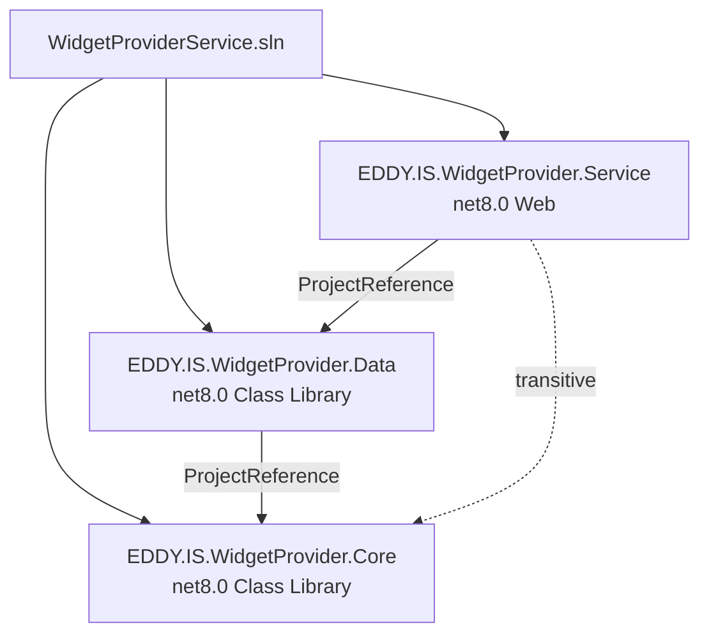
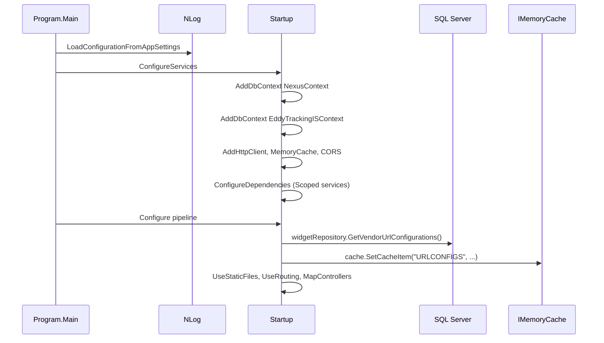
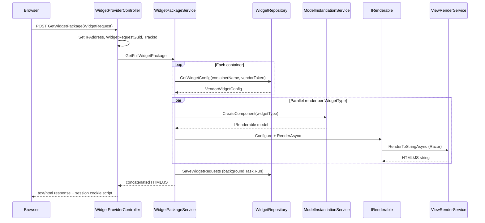

# Architecture

## Architecture Style

**Primary pattern: Layered Monolith with Component/Strategy rendering**

| Layer | Project | Responsibility |
|-------|---------|----------------|
| Presentation | `EDDY.IS.WidgetProvider.Service` | HTTP API, static files, Razor templates, DI composition root |
| Application / Domain | `EDDY.IS.WidgetProvider.Core` | Business logic, widget models, external service clients, DTOs |
| Infrastructure | `EDDY.IS.WidgetProvider.Data` | EF Core DbContexts, repository implementations |

This is **not** Clean Architecture or Onion — Core depends on ASP.NET MVC Razor (`Microsoft.AspNetCore.Mvc.Razor 2.2.0`) and WCF client proxies, and Data references Core interfaces (repository pattern with interface in Core, implementation in Data).

### Secondary Patterns Observed

| Pattern | Implementation |
|---------|----------------|
| **Repository** | `IWidgetRepository` / `WidgetRepository`, `ICampaignRepository` / `CampaignRepository` |
| **Strategy / Component** | `IRenderable` implementations per `WidgetType` |
| **Factory** | `ModelInstantiationService.CreateComponent()` |
| **Template Method** | `FormsEngineBaseModel` abstract base for form widgets |
| **Adapter** | WCF `MatchingServiceClient` wrapped by `QDFService` and `CampaignRepository` |
| **Facade** | `WidgetPackageService` orchestrates config load → render → track |
| **Cache-Aside** | `ICacheable` on `QDFLightModel`; `CacheService` with Redis + Memory |

## Why Built This Way

Evidence from code structure and naming (`EDDY.IS.*`, EducationDynamics TFS paths):

1. **Embeddable widget delivery** requires server-side HTML/JS generation — Razor views co-located in Service project (`WidgetTemplates/{WidgetType}/`) allow per-widget markup without a separate frontend build for each type.
2. **Legacy integration** — WCF Matching Engine and older Ad Listing HTTP API coexist with newer GP Listing REST API, suggesting incremental modernization (GP variants: `GPListingApi`, `GPQDFLight`, `GPExitPop`).
3. **Configuration in database** — Marketing/campaign teams configure widgets in Nexus; developers add new `WidgetType` enum values and `IRenderable` implementations.
4. **Monolith appropriate** — Single deployment unit to IIS simplifies publisher integration (one script URL).

## Solution Dependency Graph

**Note:** Service uses Core types directly in controllers and `Startup.cs` but only declares a project reference to Data. Core is available transitively via `Data → Core`.

## Startup Sequence

Reference: `Program.cs`, `Startup.cs` lines 28–118.

## Application Lifecycle (Request)

## Architectural Violations

| Violation | Evidence | Severity |
|-----------|----------|----------|
| **Core depends on web framework** | `ViewRenderService` uses `IRazorViewEngine`, `IHttpContext` | Medium — Core not reusable outside ASP.NET |
| **Presentation logic in Core** | Razor rendering path hardcoded: `~/WidgetTemplates/{widgetType}/{viewName}.cshtml` in `ViewRenderService.cs:64` | Medium — templates live in Service but path in Core |
| **Direct `new` for services** | `new AdListingApiService(_configuration)` in `AdListingApiModel.cs:71`, `ExitPopController.cs:114` | Medium — bypasses DI |
| **DbContext created manually in repository** | `WidgetRepository.SaveWidgetImpression` creates new `EddyTrackingISContext` instead of injecting scoped context | Low-Medium — bypasses DI lifetime |
| **Static fields in services** | `CacheService._config`, `AdListingApiService._config` | Low — thread-safety / testability |
| **Data layer bug mixes all settings** | `WidgetRepository.GetWidgetConfig` inner loop iterates `configList` not `component` group | High — functional bug |
| **No API versioning or auth boundary** | Open CORS + no `[Authorize]` | High — security |
| **Blocking async** | `QDFService.GetCategories` uses `.Result` on WCF async calls | Medium — scalability |

## Cross-Cutting Concerns

### Dependency Injection

See `Documentation/Diagrams/DependencyInjection.md`.

### Configuration

Bound via `IConfiguration` sections — no strongly-typed `IOptions<T>` classes except inline `GetSection()` calls. See `Documentation/Deployment/Configuration.md`.

### Authentication & Authorization

**None implemented.** `app.UseAuthorization()` is commented out in `Startup.cs:75`. Vendor identification is by GUID token passed from client, validated only for format (`Guid.TryParse`).

### Exception Handling

- No global exception middleware
- Controllers catch exceptions and return `Content("WidgetError: ...")` or log and return empty/false
- NLog writes errors to `EddyLogging.dbo.Exception` table

### Background Processing

**None.** No Hangfire, Quartz, or `IHostedService`. Impression saving uses `Task.Run` fire-and-forget in `WidgetPackageService.cs:77`.
