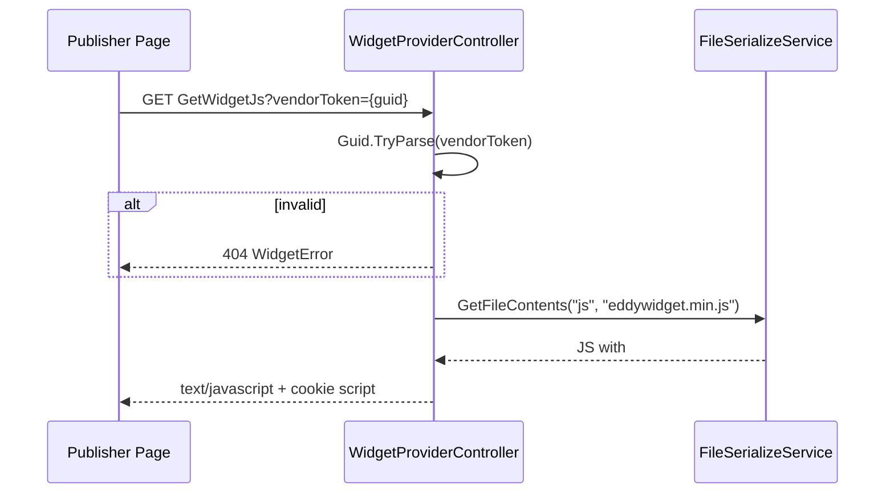
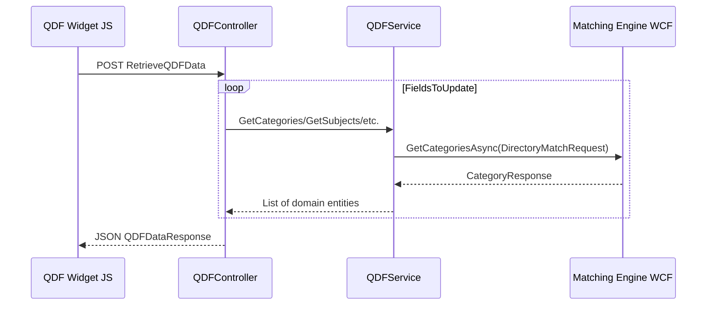

# Business Processes

## Overview

All business processes revolve around **delivering configured marketing widgets** to publisher pages and **tracking engagement**. Configuration lives in Nexus DB; this service reads it and produces renderable output.

---

## BP-01: Widget Bootstrap (Client Script Load)

### Purpose
Deliver the embeddable JavaScript loader that publishers include via `<script>` tag.

### Inputs
| Input | Source | Validation |
|-------|--------|------------|
| `vendorToken` | Query string | Must parse as `Guid`; else 404 text response |
| `checkJquery` | Query string (optional, default `true`) | Boolean |

### Outputs
- `text/javascript` body containing:
  - `checkJquery` variable
  - `globalVendorGuid`
  - Contents of `js/eddywidget.min.js` (with token replacements)
  - Cookie setter for `EddyVendorToken`

### Rules
- Token format validation only — **no DB lookup** (TODO at line 33)
- `Access-Control-Max-Age: 600` header set

### Edge Cases
- Invalid GUID → `WidgetError: Invalid Vendor Token.`
- Exception → `WidgetError: {message}` (may leak internal errors)

### Failure Handling
Logged via `ILogger`; HTTP 500 not set (commented out)

### Related Classes
`WidgetProviderController`, `FileSerializeService`

### Related Tables
None (no DB access)

### Sequence Diagram

---

## BP-02: Full Widget Package Render

### Purpose
Primary workflow — render all widgets for containers on a publisher page.

### Inputs (`WidgetRequest` DTO)
| Field | Business Meaning |
|-------|------------------|
| `VendorToken` | Publisher identity |
| `ContainerList` | Named DOM containers + per-site settings |
| `PageUrl`, `ReferrerUrl` | Attribution / URL-based config |
| `UserAgent`, `IPAddress` (set server-side) | Targeting |
| `TrackId` / `CookieTrackId` | Campaign tracking override |
| `FilterFields` | Prospect qualification data |
| `LoadExternalResources` | Include CSS/JS CDN links (default true) |

### Outputs
- Concatenated HTML/JS strings for all widgets
- Inline script: `widget_setCookie('EddyWidgetSession', '{guid}')`
- `text/html` content type

### Validation
- Empty result → `WidgetError: No widgets found for VendorToken - {token}`
- Container config missing → widget silently skipped (`vendorWidgetConfig == null`)

### Rules
1. Each container resolved via `GetWidgetConfig(containerName, vendorToken)`
2. Site settings merged with URL query params (GP listing types) and cached URL configs
3. Widgets grouped by `WidgetType`, rendered in **descending enum order** (`OrderByDescending`)
4. Optional JS minification if `MinifyJavascript=true`
5. Render timing logged to `EddyTrackingIS.WS.WidgetRequest` (excludes `admin.educationdynamics.com`)

### Edge Cases
- Multiple containers same type → rendered in parallel, concatenated
- `UpdateWidget=true` → some models skip external resource loading
- Admin page URL → tracking skipped

### Failure Handling
Exception logged; partial `fullWidgetString` may be returned

### Related Classes
`WidgetPackageService`, `ModelInstantiationService`, `WidgetRepository`, all `IRenderable` models

### Related Tables
- Read: `WS.VW_VendorWidgetConfiguration`, `WS.VendorWidgetUrlParameterConfig`
- Write: `EddyTrackingIS.WS.WidgetRequest`

### Sequence Diagram
See `Documentation/Architecture.md` request lifecycle diagram.

---

## BP-03: Widget Impression Save

### Purpose
Record that a widget session was actually displayed to the user.

### Inputs
`widgetSessionGuid` (from `EddyWidgetSession` cookie)

### Outputs
Void HTTP response (no body contract)

### Rules
Insert into `EddyTrackingIS.WS.WidgetImpression`

### Failure Handling
Logged; silent failure to client

---

## BP-04: QDF Cascading Field Data

### Purpose
Power dynamic dropdowns in QDF Light widgets — as user selects category, load valid subjects, etc.

### Inputs (`QDFDataRequest`)
- `TrackId` — campaign GUID
- `CurrentData` — dictionary of field code → value
- `FieldsToUpdate` — map of field name → comma-separated predecessor field codes
- `IgnoreTrackId` — pass-through to Matching Engine

### Outputs
`QDFDataResponse.ReturnData` — field name → list of `{Id, Name}` options

### Validation
- `TrackId` parsed with `Guid.Parse` — throws if invalid (no try/catch in controller)

### Rules
Supported fields: `Categories`, `SubCategories`, `Specialties`, `Desired_Degree_Level`
Each calls Matching Engine with predecessor filters mapped via `MapFromCode`

### Related Classes
`QDFController`, `QDFService`, `MatchingServiceClient`

### Related Tables
Read: `WS.VW_QDFTemplateConfiguration` (for initial template, not this endpoint)

### Sequence Diagram

---

## BP-05: Exit Pop — Eligibility Check

### Purpose
Determine if exit-intent popup should activate for a campaign.

### Inputs
`trackId` (string GUID in JSON body)

### Outputs
`bool` — `campaign.AllowExitPops` from Matching Engine

### Failure Handling
Any exception → `false`

### Related Classes
`ExitPopController`, `CampaignRepository`, `MatchingServiceClient`

---

## BP-06: Exit Pop — Ad Render

### Purpose
On exit intent, fetch ads and return HTML for modal display.

### Inputs
`WidgetRequest` with `ContainerList` containing Exit pop container

### Outputs
HTML string (ad listing markup) or empty string

### Rules
1. Exactly one `ExitPop` or `GPExitPop` widget per request — else exception
2. **ExitPop** → legacy `AdListingApiService` (GET)
3. **GPExitPop** → `GPListingApiService` (POST)
4. Filters cleaned/mapped via `CleanFilters` (20+ field mappings)

### Edge Cases
- Exception message returned directly to client (`return ex.Message`) — security risk
- `AdListingApiService` instantiated with `new`, not DI

### Related Tables
Read: `WS.VW_VendorWidgetConfiguration`

---

## BP-07: URL Configuration Prefill

### Purpose
Auto-populate widget site settings based on publisher page URL.

### When
- Application startup (`Startup.Configure`)
- Runtime fallback in `WidgetPackageService.AugmentSiteSettingsFromUrlConfig`

### Data Source
`WS.VendorWidgetUrlParameterConfig` where `IsEnabled=true`

### Cached As
`URLCONFIGS` in `IMemoryCache` (indefinite expiration)

### Mapping
URL → `{categories, subcategories, specialties, statecode, degreelevels}`

---

## BP-08: Forms Engine Session Enrichment (GP Listing)

### Purpose
Merge in-progress form data from Redis into GP listing API filters.

### When
`GPListingApiModel.Configure` when `fesessionid` in site settings

### Redis Key Pattern
`{FormsEngineRedisCachePrefix}.FE.Session[{fesessionid}]`

### Filtered Keys
Only `FE_SUPPORTEDKEYS` (38 fields) merged into site settings

### Related Classes
`FESessionRedisService`, `GPListingApiModel`

---

## Widget Type Catalog

| WidgetType | ID | Model Class | Primary Integration |
|------------|-----|-------------|-------------------|
| AdStackSolo | 1 | `AdStackSoloModel` | Ad Server (client-side aggregator) |
| SmartListing | 2 | `SmartListingModel` | Forms Engine + Ad Server |
| QDF | 3 | `QDFModel` | Forms Engine QDF |
| ProgramForm | 4 | `WizardFormModel` | Forms Engine |
| LeaveBehind | 5 | `LeaveBehindModel` | Static |
| WizardForm | 6 | `WizardFormModel` | Forms Engine |
| AdListingApi | 7 | `AdListingApiModel` | Ad Listing API |
| QDFLight | 8 | `QDFLightModel` | Matching Engine + local QDF JS |
| ExitPop | 9 | `ExitPopModel` | Ad Listing API (on exit) |
| GPQDFLight | 10 | `GPQDFLightModel` | GP variant of QDF Light |
| GPListingApi | 11 | `GPListingApiModel` | GP Listing API + Redis FE session |
| GPExitPop | 12 | `GPExitPopModel` | GP Listing API (on exit) |

Reference: `VendorWidgetConfig.cs` enum `WidgetType`; `ModelInstantiationService.cs` switch.
