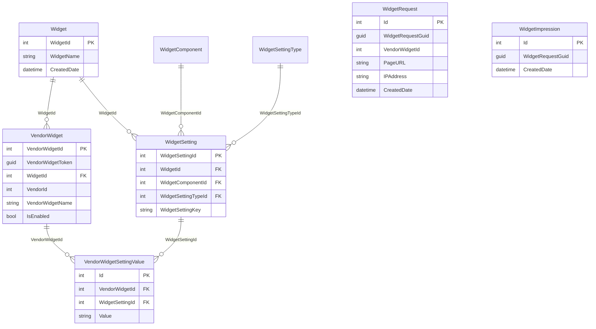

# Database Documentation

## Overview

The application uses **database-first Entity Framework Core** with **no EF migrations** in the repository. Schema is assumed to exist in SQL Server and is mapped via `OnModelCreating` in DbContext classes.

Two databases are actively used; a third is referenced only for logging.

| Database | DbContext | Connection String Key | Schema |
|----------|-----------|---------------------|--------|
| **Nexus** | `NexusContext` | `DefaultConnection` | `WS`, `dbo` |
| **EddyTrackingIS** | `EddyTrackingISContext` | `EddyTrackingISConnection` | `WS` |
| **EddyLogging** | *(NLog only, no EF)* | `EddyLoggingConnection` | `dbo` |

---

## DbContexts

### NexusContext

**File:** `EDDY.IS.WidgetProvider.Data/Entities/NexusContext.cs`

**Registered:** `Startup.cs:33` — `AddDbContext<NexusContext>`

**DbSets:**
| DbSet | Maps To | Type |
|-------|---------|------|
| `VendorWidget` | `WS.VendorWidget` | Table |
| `VendorWidgetSettingValue` | `WS.VendorWidgetSettingValue` | Table |
| `Widget` | `WS.Widget` | Table |
| `Campaigns` | `dbo.Campaign` | Table |
| `WidgetComponent` | `WS.WidgetComponent` | Table |
| `WidgetSetting` | `WS.WidgetSetting` | Table |
| `WidgetSettingType` | `WS.WidgetSettingType` | Table |
| `VwVendorWidgetConfiguration` | `WS.VW_VendorWidgetConfiguration` | **View** (keyless) |
| `VwQDFTemplateConfiguration` | `WS.VW_QDFTemplateConfiguration` | **View** (keyless) |
| `VendorWidgetUrlParameterConfig` | `WS.VendorWidgetUrlParameterConfig` | Table |

### EddyTrackingISContext

**File:** `EDDY.IS.WidgetProvider.Data/Entities/EddyTrackingISContext.cs`

**Registered:** `Startup.cs:34`

**Note:** Also instantiated manually in `WidgetRepository` for writes (bypasses DI scope).

**DbSets:**
| DbSet | Maps To |
|-------|---------|
| `WidgetRequest` | `WS.WidgetRequest` |
| `WidgetImpression` | `WS.WidgetImpression` |

---

## Entity Relationship Diagram



**Inferred relationships:** Foreign keys defined in `NexusContext.OnModelCreating`. `Campaign` entity exists but has **no navigation properties** and is **not queried** by this application (only referenced in EF model).

**Views:** `VW_VendorWidgetConfiguration` and `VW_QDFTemplateConfiguration` flatten widget settings for read performance — relationships inferred from view columns, not EF navigation.

---

## Tables Detail

### WS.VendorWidget
| Column | Type | Notes |
|--------|------|-------|
| VendorWidgetId | int | PK |
| VendorWidgetToken | uniqueidentifier | Maps to client `VendorToken` |
| WidgetId | int | FK → Widget (determines WidgetType) |
| VendorId | int | Publisher vendor |
| VendorWidgetName | nvarchar(50) | DOM container name |
| IsEnabled | bit | Not filtered in repository queries |
| CreatedDate | datetime | |

### WS.VendorWidgetSettingValue
Per-vendor overrides of widget settings.

### WS.Widget
`WidgetId` is **not identity** (`ValueGeneratedNever`) — enum-aligned IDs matching `WidgetType`.

### WS.WidgetComponent
| WidgetComponentId | Name (inferred) |
|-------------------|-----------------|
| 1 | AdServer |
| 2 | FormsEngine |
| 3 | Custom |

Matches `WidgetComponentType` enum in Core.

### WS.WidgetSetting / WS.WidgetSettingType
Define available settings per widget/component (keys like `trackid`, `placementtoken`, `templateid`).

### WS.VendorWidgetUrlParameterConfig
URL-based default settings for publisher pages.

| Column | Purpose |
|--------|---------|
| Url | Page URL (without query string) |
| Categories, SubCategories, Specialties, States, DegreeLevels | Prefill values |
| IsEnabled | Filtered `= true` |

### EddyTrackingIS.WS.WidgetRequest
Analytics record per widget render.

| Column | Max Length | Source |
|--------|------------|--------|
| WidgetRequestGuid | — | Server-generated |
| VendorWidgetId | — | Config |
| PageURL | 4000 | Split from PageUrl |
| PageQueryString | 4000 | Split from PageUrl |
| ReferringURL | 4000 | Split from ReferrerUrl |
| IPAddress | 50 | Server-derived |
| UserAgent | 500 | Client |
| WidgetSettingsJson | 4000 | Serialized site settings |
| RenderTimeMilliseconds | — | Stopwatch |
| JqueryVersionNumber | 10 | Client |

### EddyTrackingIS.WS.WidgetImpression
| Column | Purpose |
|--------|---------|
| WidgetRequestGuid | Links to session cookie |
| CreatedDate | Timestamp |

---

## Views

### WS.VW_VendorWidgetConfiguration
Denormalized join used by `WidgetRepository.GetWidgetConfig`.

Columns: `VendorWidgetId`, `VendorWidgetName`, `SettingValue`, `WidgetSettingKey`, `WidgetComponentId`, `WidgetServiceToken`, `WidgetId`, `CustomCSS`

### WS.VW_QDFTemplateConfiguration
QDF template field definitions for `GetQDFTemplate`.

Columns include: `TemplateId`, `TemplateStepId`, `RowSequence`, `Code`, `FieldName`, `IsRequired`, `InstanceLabel`, `InstanceWatermark`, `StandardControlTypeName`, `Header`, `SubHeading`, `TemplateName`

---

## Stored Procedures, Functions, Triggers

**None referenced in codebase.** Confidence: high — all data access is LINQ via EF Core DbSets.

---

## Migration History

**No EF migrations exist** in repository. Schema changes are managed externally (likely DBA scripts in separate repo). Confidence: high — `Glob **/Migrations/**` returned 0 files.

---

## Soft Delete Strategy

**Not implemented.** No `IsDeleted` columns on tracked entities. `VendorWidget.IsEnabled` exists but is not checked in `GetWidgetConfig` query.

---

## Audit Fields

| Pattern | Entities |
|---------|----------|
| `CreatedDate` | VendorWidget, Widget, WidgetSetting, WidgetRequest, WidgetImpression, VendorWidgetUrlParameterConfig |
| No `ModifiedDate` / `ModifiedBy` | All entities |

---

## Known Data Access Issues

### GetWidgetConfig settings duplication bug

```csharp
// WidgetRepository.cs lines 46-56
foreach (var component in componentGrouping)
{
    var settingDict = new Dictionary<string, string>();
    foreach (var config in configList)  // BUG: should filter by component
    {
        settingDict.Add(config.WidgetSettingKey, config.SettingValue);
    }
    widgetConfig.SystemSettings.Add((WidgetComponentType)component.First().WidgetComponentId, settingDict);
}
```

**Impact:** Each `WidgetComponentType` dictionary contains ALL settings, not just that component's. May cause duplicate key exceptions or wrong settings. Confidence: high.

### Manual DbContext in repository

`SaveWidgetImpression` and `SaveWidgetRequests` create new `EddyTrackingISContext` with `new DbContextOptionsBuilder` rather than using injected scoped context — may cause connection pool pressure under load.
