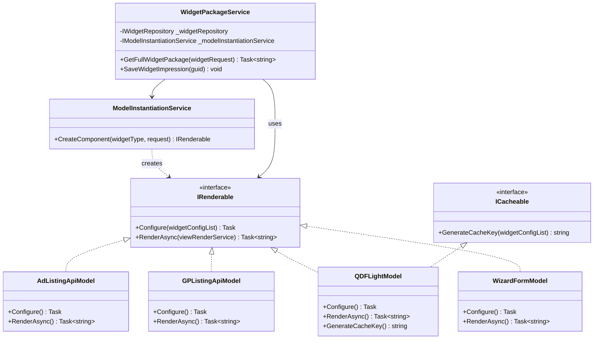
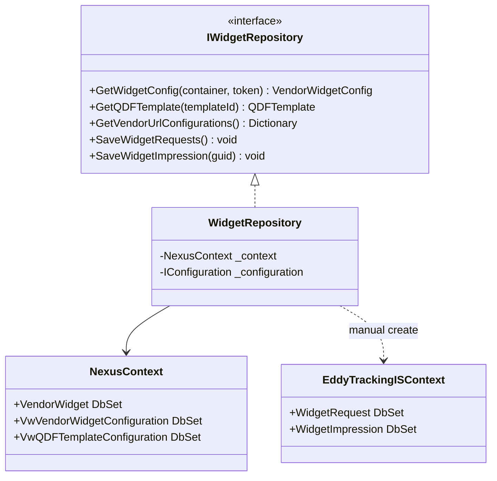
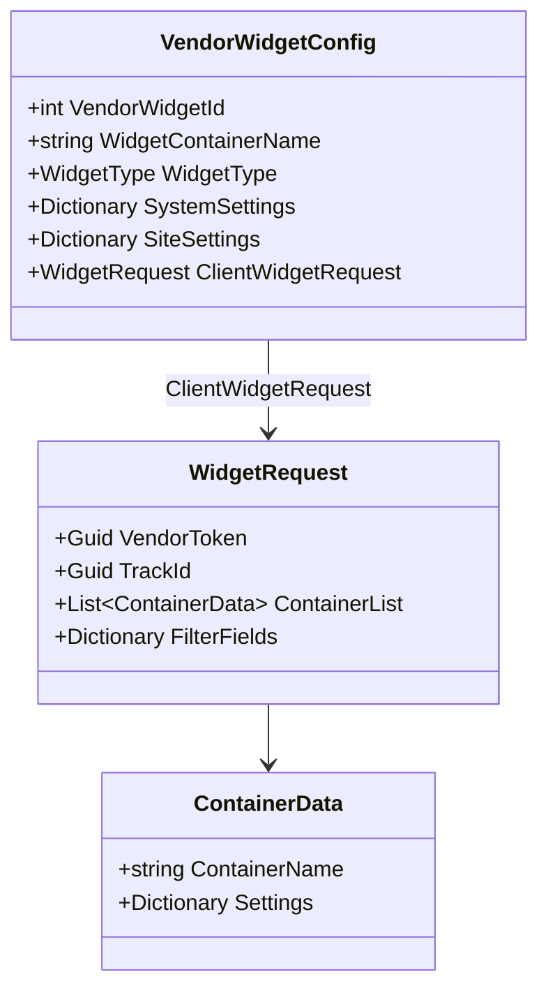
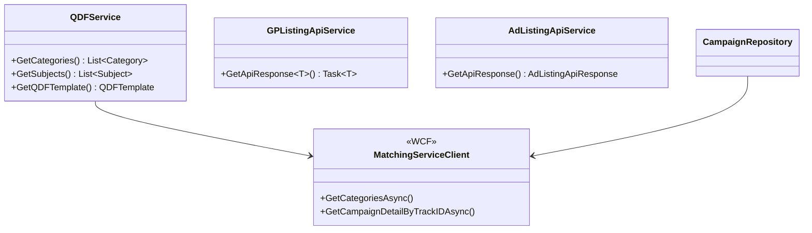

# Class Diagrams

## Core Widget Rendering

```mermaid
classDiagram
    class IRenderable {
        <<interface>>
        +Configure(widgetConfigList) Task
        +RenderAsync(viewRenderService) Task~string~
    }

    class ICacheable {
        <<interface>>
        +GenerateCacheKey(widgetConfigList) string
    }

    class WidgetPackageService {
        -IWidgetRepository _widgetRepository
        -IModelInstantiationService _modelInstantiationService
        +GetFullWidgetPackage(widgetRequest) Task~string~
        +SaveWidgetImpression(guid) void
    }

    class ModelInstantiationService {
        +CreateComponent(widgetType, request) IRenderable
    }

    class AdListingApiModel {
        +Configure() Task
        +RenderAsync() Task~string~
    }

    class GPListingApiModel {
        +Configure() Task
        +RenderAsync() Task~string~
    }

    class QDFLightModel {
        +Configure() Task
        +RenderAsync() Task~string~
        +GenerateCacheKey() string
    }

    class WizardFormModel {
        +Configure() Task
        +RenderAsync() Task~string~
    }

    IRenderable <|.. AdListingApiModel
    IRenderable <|.. GPListingApiModel
    IRenderable <|.. QDFLightModel
    IRenderable <|.. WizardFormModel
    ICacheable <|.. QDFLightModel

    WidgetPackageService --> ModelInstantiationService
    ModelInstantiationService ..> IRenderable : creates
    WidgetPackageService --> IRenderable : uses
```

## Data Layer

```mermaid
classDiagram
    class IWidgetRepository {
        <<interface>>
        +GetWidgetConfig(container, token) VendorWidgetConfig
        +GetQDFTemplate(templateId) QDFTemplate
        +GetVendorUrlConfigurations() Dictionary
        +SaveWidgetRequests() void
        +SaveWidgetImpression(guid) void
    }

    class WidgetRepository {
        -NexusContext _context
        -IConfiguration _configuration
    }

    class NexusContext {
        +VendorWidget DbSet
        +VwVendorWidgetConfiguration DbSet
        +VwQDFTemplateConfiguration DbSet
    }

    class EddyTrackingISContext {
        +WidgetRequest DbSet
        +WidgetImpression DbSet
    }

    IWidgetRepository <|.. WidgetRepository
    WidgetRepository --> NexusContext
    WidgetRepository ..> EddyTrackingISContext : manual create
```

## Configuration Model

```mermaid
classDiagram
    class VendorWidgetConfig {
        +int VendorWidgetId
        +string WidgetContainerName
        +WidgetType WidgetType
        +Dictionary SystemSettings
        +Dictionary SiteSettings
        +WidgetRequest ClientWidgetRequest
    }

    class WidgetRequest {
        +Guid VendorToken
        +Guid TrackId
        +List~ContainerData~ ContainerList
        +Dictionary FilterFields
    }

    class ContainerData {
        +string ContainerName
        +Dictionary Settings
    }

    VendorWidgetConfig --> WidgetRequest : ClientWidgetRequest
    WidgetRequest --> ContainerData
```

## External Service Clients

```mermaid
classDiagram
    class QDFService {
        +GetCategories() List~Category~
        +GetSubjects() List~Subject~
        +GetQDFTemplate() QDFTemplate
    }

    class GPListingApiService {
        +GetApiResponse~T~() Task~T~
    }

    class AdListingApiService {
        +GetApiResponse() AdListingApiResponse
    }

    class MatchingServiceClient {
        <<WCF>>
        +GetCategoriesAsync()
        +GetCampaignDetailByTrackIDAsync()
    }

    QDFService --> MatchingServiceClient
    CampaignRepository --> MatchingServiceClient
```
