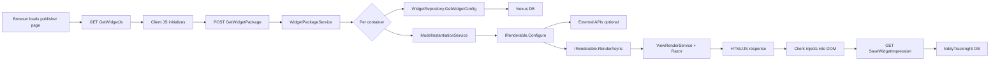
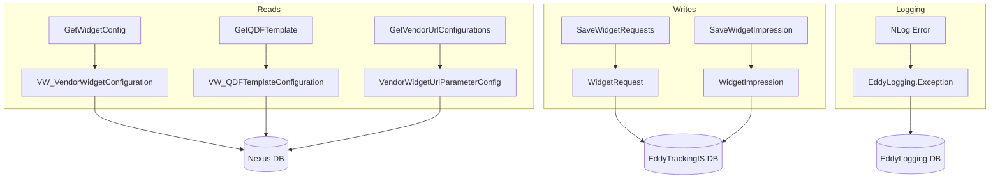
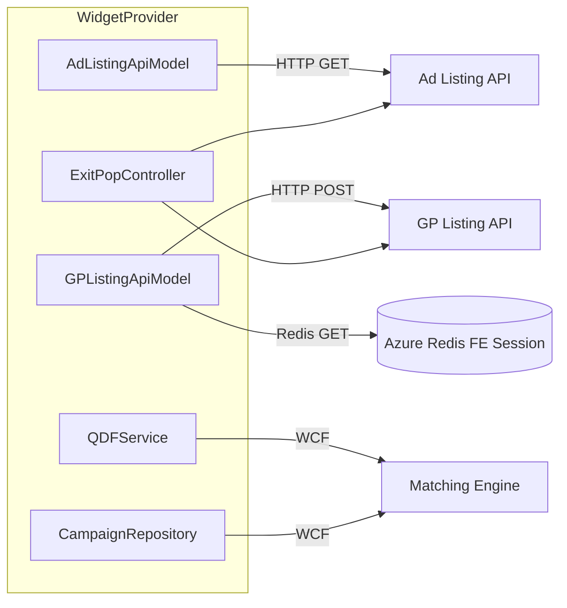
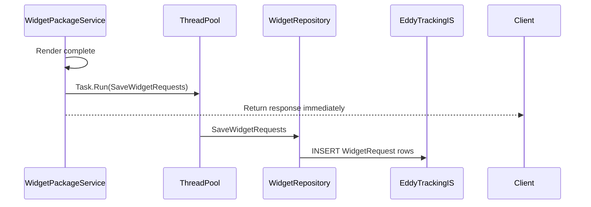
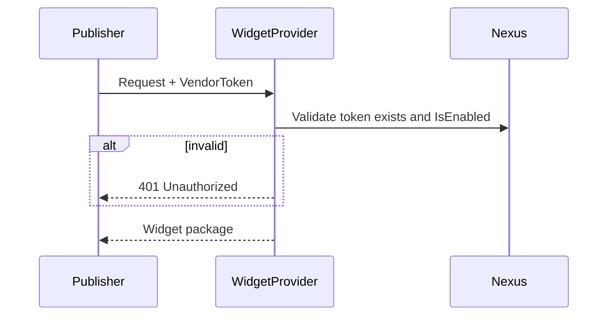

# Data Flow Diagrams

## Request Lifecycle

## Database Interactions

## External API Interactions

## Authentication Flow

**Not implemented.** No login, JWT, cookies for API auth, or policy-based authorization.

Publisher identification is implicit via `VendorToken` GUID in request payload — not cryptographically verified.

## Background Processing

No scheduled jobs, queues, or retry logic.

## Authentication Flow (Target State — Recommended)

*This diagram represents a recommended future state, not current behavior.*
