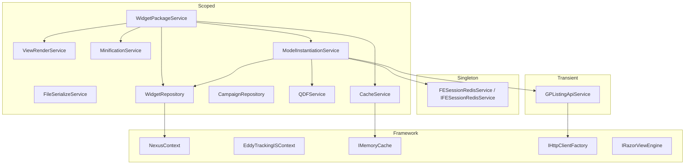

# Dependency Injection

## Registration (Startup.cs)

## Lifetime Summary

| Lifetime | Services |
|----------|----------|
| **Singleton** | `IFESessionRedisService` |
| **Scoped** | All repositories, application services, `ICacheService` |
| **Transient** | `IGPListingApiService` |
| **Scoped (EF)** | `NexusContext`, `EddyTrackingISContext` |

## Not Registered (Manual Instantiation)

| Type | Instantiated In |
|------|-----------------|
| `AdListingApiService` | `AdListingApiModel`, `ExitPopController` |
| `EddyTrackingISContext` | `WidgetRepository` (manual `new`) |
| `MatchingServiceClient` | `QDFService`, `CampaignRepository` |
| Component `*Model` classes | `ModelInstantiationService` (factory, not DI) |

## Factories

- **`IHttpClientFactory`** — registered via `services.AddHttpClient()`; used by `GPListingApiService`
- **`ModelInstantiationService`** — manual factory for `IRenderable` by `WidgetType`

## Hosted / Background Services

**None registered.**

Fire-and-forget: `Task.Run(() => _widgetRepository.SaveWidgetRequests(...))` in `WidgetPackageService`.

## Middleware Pipeline Order

1. Developer exception page (dev only)
2. URL config cache warm-up (inline in `Configure`)
3. Static files (`testclients`, `css`, `images`)
4. Routing
5. CORS
6. Endpoints (MVC default route)

**Not enabled:** HTTPS redirection, Authorization, Authentication

## Composition Root

`Startup.ConfigureServices` and `ConfigureDependencies` — single composition root in Service project.

Core and Data libraries do not self-register (no `IServiceCollection` extension methods).
