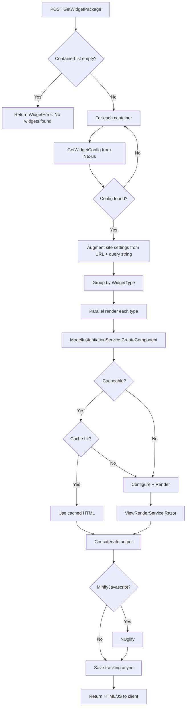
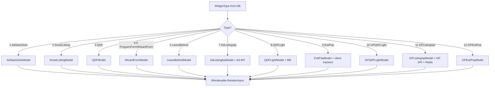
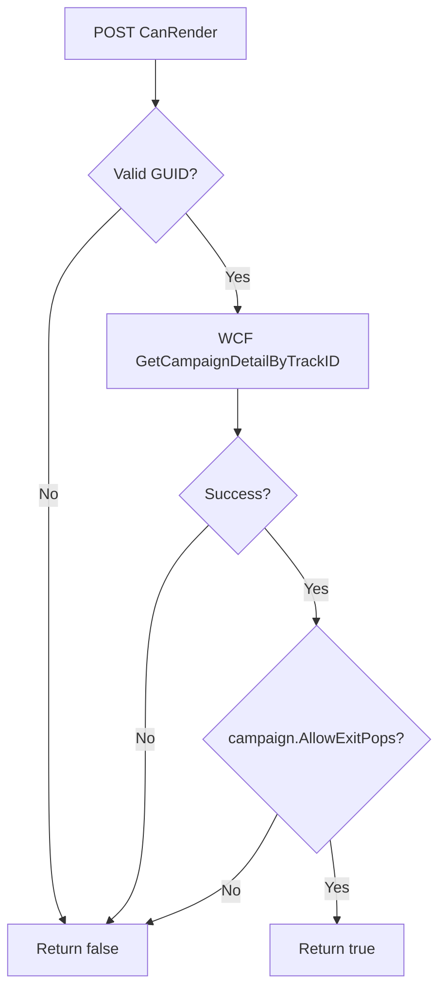
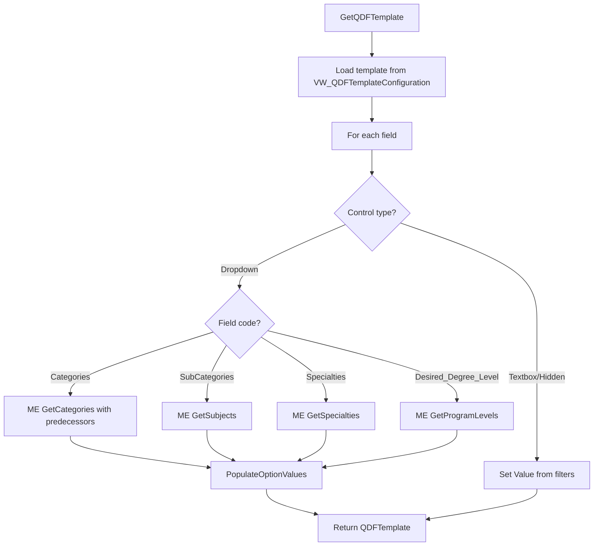
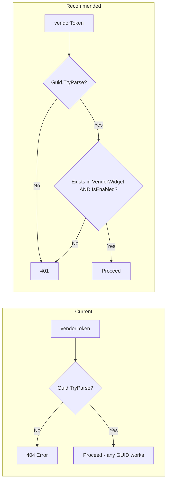

# Flowcharts — Business Processes

## Widget Package Decision Flow

## Widget Type Routing

## Exit Pop Eligibility

## QDF Field Population

## Vendor Token Validation (Current vs Recommended)

