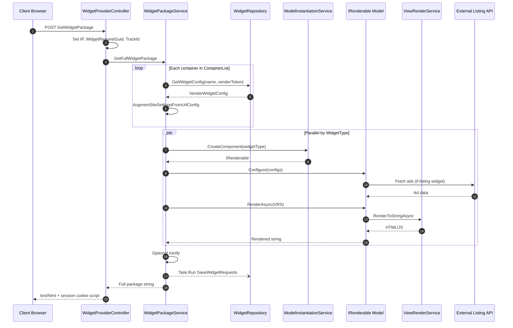
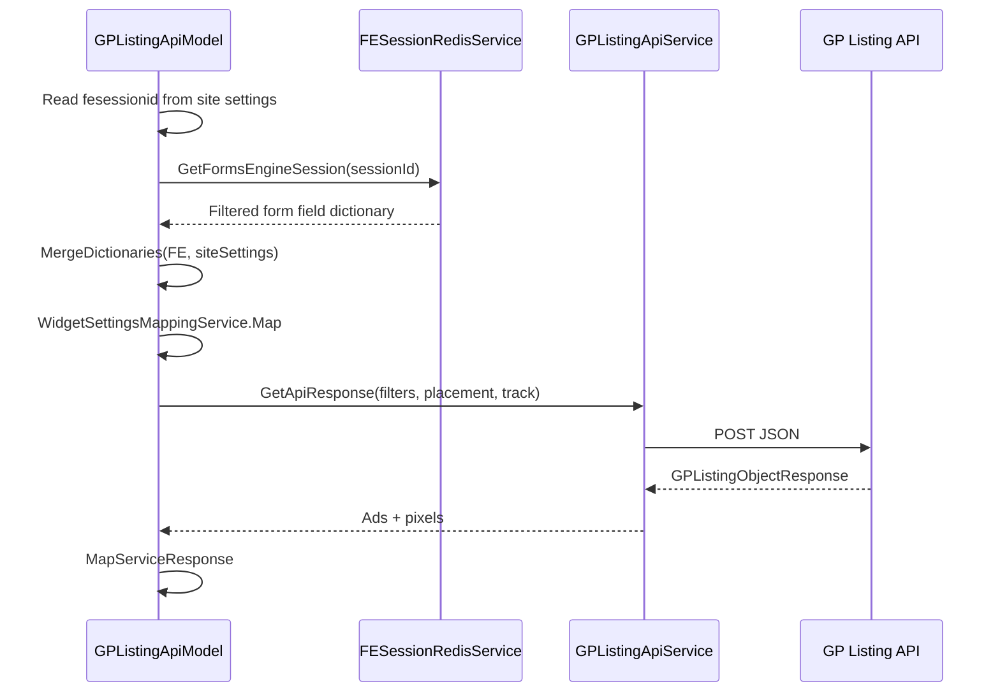
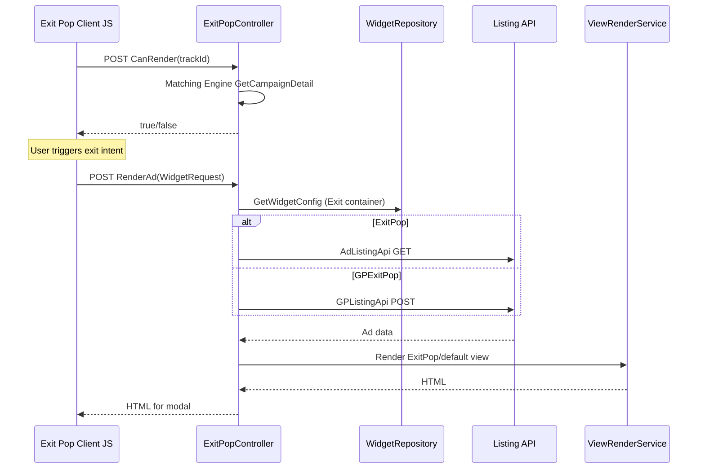
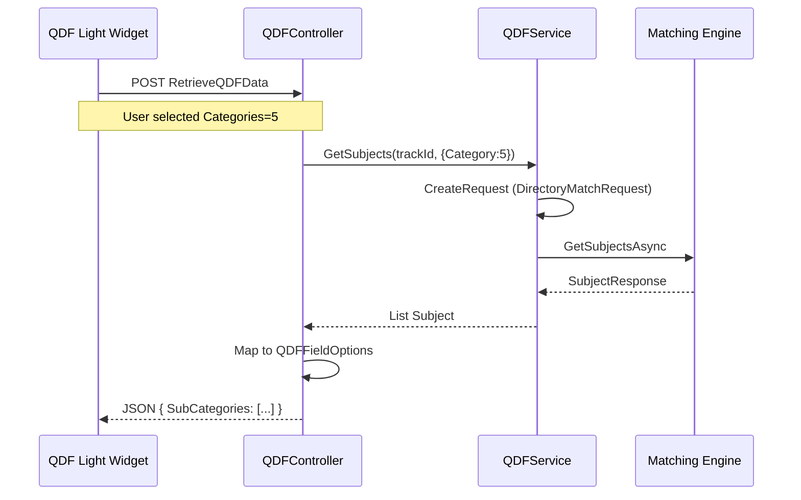
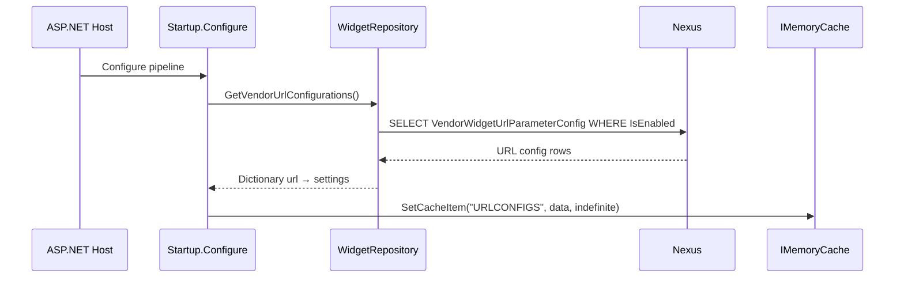

# Sequence Diagrams — Major Workflows

## Widget Package Delivery

## GP Listing Widget with Forms Engine Session

## Exit Pop Render

## QDF Cascading Dropdown

## Application Startup Cache Warm

