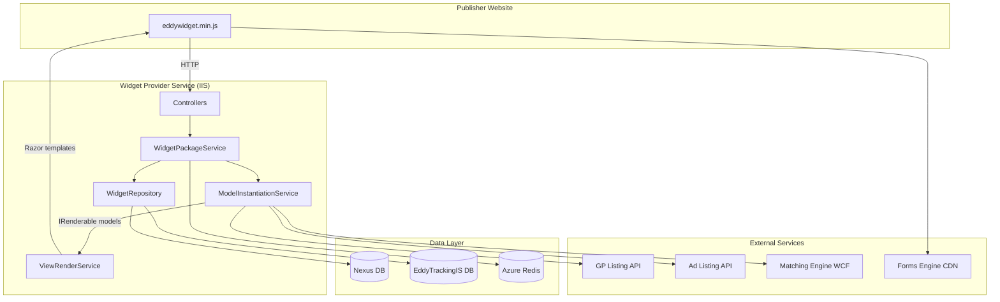

# Executive Summary — Widget Provider Service

## What the Application Does

**Widget Provider Service** (`EDDY.IS.WidgetProvider.Service`) is an ASP.NET Core 8 web API and Razor view host that serves **embeddable JavaScript/HTML widget packages** to third-party publisher websites in the EducationDynamics (Eddy) advertising ecosystem.

Publishers embed a small bootstrap script (`eddywidget.min.js`) on their pages. That script calls back to this service, which:

1. Validates the publisher **vendor token** (GUID).
2. Loads widget configuration from SQL Server (`Nexus` database).
3. Renders one or more widget types (ad listings, forms, QDF questionnaires, exit pops) as inline HTML/JavaScript.
4. Tracks widget requests and impressions in a separate tracking database (`EddyTrackingIS`).
5. Integrates with external ad listing APIs, Forms Engine, and a WCF Matching Engine for dynamic form data.

Evidence: `WidgetProviderController.GetWidgetJs` and `GetWidgetPackage` in `EDDY.IS.WidgetProvider.Service/Controllers/WidgetProviderController.cs`; orchestration in `EDDY.IS.WidgetProvider.Core/Services/WidgetPackageService.cs`.

## Business Problem It Solves

Education publishers need a **centralized, configuration-driven way** to embed lead-generation widgets (ads, forms, qualification flows) without hosting Eddy infrastructure themselves. This service:

- Decouples widget **configuration** (stored in Nexus DB per vendor/container) from **rendering** (server-side Razor templates + client JS).
- Provides a single integration point (`/api/WidgetProvider/*`) for all widget types.
- Enables campaign tracking via `TrackId`, session cookies, and impression logging.

## Primary Users

| User | Interaction |
|------|-------------|
| **Publisher web developers** | Embed `GetWidgetJs` script tag; call `GetWidgetPackage` from client JS |
| **Eddy campaign administrators** | Configure widgets in Nexus (not in this repo — inferred from DB schema) |
| **End users (prospects)** | Interact with rendered widgets on publisher sites |
| **Internal engineers / DevOps** | Deploy to IIS, monitor logs, manage Redis/cache |

## Major Workflows

1. **Widget bootstrap** — Publisher loads JS via `GET /api/WidgetProvider/GetWidgetJs?vendorToken={guid}`
2. **Widget package render** — Client POSTs container list → `POST /api/WidgetProvider/GetWidgetPackage`
3. **Widget update** — Partial re-render without external resources → `POST /api/WidgetProvider/UpdateWidgetPackage`
4. **Impression tracking** — `GET /api/WidgetProvider/SaveWidgetImpression?widgetSessionGuid={guid}`
5. **QDF cascading dropdowns** — `POST /api/QDF/RetrieveQDFData` (categories → subjects → specialties → degree levels)
6. **Exit pop** — Mouse-leave detection client-side; server renders ad HTML via `POST /api/ExitPop/RenderAd`

## Major Integrations

| System | Purpose | Config Key |
|--------|---------|------------|
| **Nexus SQL Server** | Widget/vendor configuration | `ConnectionStrings:DefaultConnection` |
| **EddyTrackingIS SQL Server** | Request/impression analytics | `ConnectionStrings:EddyTrackingISConnection` |
| **EddyLogging SQL Server** | Exception logging via NLog | `ConnectionStrings:EddyLoggingConnection` |
| **Azure Redis** | Widget render cache + Forms Engine session data | `ConnectionStrings:RedisConnection` |
| **Ad Listing API** (legacy) | Institution ad listings | `AdListingApiURL` |
| **GP Listing API** | Graduate Programs ad listings | `GPListingApiURL` |
| **Matching Engine WCF** | QDF field options + exit pop eligibility | `MatchingServiceURL` |
| **Forms Engine** (CDN) | Bundled wizard/QDF JS | `ScriptSources:BundledWizardJs`, etc. |
| **Ad Aggregator** (CDN) | Exit pop client scripts | `ScriptSources:AdAggregator` |

## High-Level Architecture

**Style:** Layered monolith with **Strategy/Component** pattern for widget types (`IRenderable` + `ModelInstantiationService` factory).

## Technology Stack

| Layer | Technology |
|-------|------------|
| Runtime | .NET 8.0 |
| Web framework | ASP.NET Core MVC + API Controllers |
| View engine | Razor (embedded in Service project `WidgetTemplates/`) |
| ORM | Entity Framework Core 6.0 (database-first, no migrations) |
| Logging | NLog 4.x (file + SQL + console) |
| Caching | `IMemoryCache` + StackExchange.Redis |
| HTTP clients | `IHttpClientFactory` (GP API), raw `HttpClient` (Ad API) |
| WCF client | `System.ServiceModel.*` (Matching Engine) |
| JS minification | NUglify |
| CI/CD | Azure DevOps Pipelines → IIS on Windows |

## Deployment Model

- **Target:** Windows IIS (`widget.educationdynamics.com`)
- **Path:** `F:\inetpub\wwwroot\widget.educationdynamics.com`
- **Build:** Azure Pipelines (`azure-pipelines.yaml`, `ci-pipelines.yaml`) using shared templates from `Technology Management/AzurePipelines`
- **Environments:** `development`, `qa`, `uat` branches trigger deploy; `feature/*` triggers CI only
- **Auth:** Windows integrated SQL (`Trusted_Connection=True`) — inferred from connection strings

## Strengths

- **Pluggable widget architecture** via `IRenderable` + factory (`ModelInstantiationService`) — easy to add new widget types
- **Configuration-driven** — widget behavior controlled by Nexus DB, not code deploys
- **Parallel widget rendering** — `Task.WhenAll` in `WidgetPackageService` (line 66–71)
- **URL-based prefill** — `VendorWidgetUrlParameterConfig` cached at startup for page-specific defaults
- **Forms Engine session merge** — Redis lookup enriches GP listing filters with in-progress form data

## Weaknesses

- **No authentication/authorization** on API endpoints — vendor token is only format-validated, not authorized against DB (`WidgetProviderController` line 33 TODO)
- **Secrets in appsettings** — Redis password committed in config files
- **Inconsistent HTTP client usage** — `AdListingApiService` uses static config + new `HttpClient` per call; blocking `.Result` in `QDFService`
- **Duplicated IP extraction logic** across 3 controllers
- **No automated tests** in solution
- **EF Core version mismatch** — EF 6.0 packages on .NET 8 runtime
- **Service project does not reference Core directly** — relies on transitive reference through Data

## Technical Debt (High Priority)

| Item | Location | Impact |
|------|----------|--------|
| Vendor token not validated against DB | `WidgetProviderController.cs:33` | Security — any valid GUID works |
| Redis credentials in source | `appsettings.json:42` | Security |
| `GetWidgetConfig` settings bug — all settings added per component | `WidgetRepository.cs:50-53` | Incorrect widget config (high confidence) |
| Exception messages returned to client | `ExitPopController.cs:88-89` | Information disclosure |
| `AdListingApiService` not registered in DI; instantiated with `new` | `AdListingApiModel.cs:71`, `ExitPopController.cs:114` | Testability, connection pooling |
| No EF migrations — schema managed externally | No `Migrations/` folder | Drift risk between code and DB |
| CORS `AllowAnyOrigin` | `Startup.cs:50` | Cross-origin abuse if combined with missing auth |
| Comment says "Ad Reporting Service" in `Program.cs:19` | Naming drift from original purpose |
